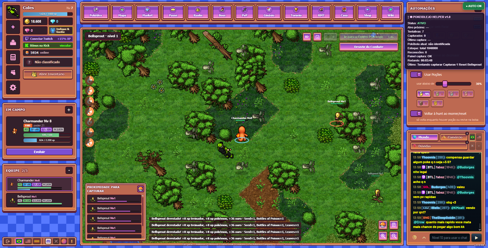

# 🟣 PokeIdle.io — Auto Helper

> Extensão para navegadores Chromium que automatiza a captura pela lista **PROXIMIDADE PARA CAPTURAR** do PokeIdle.io, mantendo histórico, HUD e controles rápidos sem depender de automações VIP do jogo.


<p align="center">
  
</p>

## ✨ O que a extensão faz

Esta versão foi criada especificamente para a mecânica do `pokeidle.io/app`: o alvo de captura não é um botão separado, mas sim o **retângulo com o nome do Pokémon** dentro do painel **PROXIMIDADE PARA CAPTURAR**.

Principais recursos:

- 🎯 Clica automaticamente no primeiro Pokémon disponível em **PROXIMIDADE PARA CAPTURAR**.
- ⏱️ Delay padrão de aproximadamente **2,05 segundos** entre tentativas.
- 🧠 Mantém referência ao painel para reduzir leituras desnecessárias da página.
- 📚 Histórico de capturas e contagem por espécie.
- ✨ Identificação de Shiny quando a mensagem da página permite detectar.
- 📦 Leitura e alertas de estoque de Pokébolas quando disponíveis na interface.
- 🧭 HUD dentro do jogo com informações do helper.
- 🖱️ HUD arrastável, com posição persistente.
- ⚡ Botão rápido **AUTO ON / AUTO OFF**.
- ⌨️ Atalho **`Alt + Shift + P`** para pausar ou ativar.
- 🔌 Rotinas de reconexão/recuperação para estados reconhecíveis.
- 📊 Exportação do histórico em CSV.
- 💾 Configurações armazenadas localmente.

## 🚀 Instalação

1. Baixe a versão mais recente em **Releases** ou use `dist/pokeidle-io-auto-helper-v1.1.0.zip`.
2. Extraia o arquivo em uma pasta permanente.
3. Abra:
   - Opera GX: `opera://extensions`
   - Chrome: `chrome://extensions`
   - Edge: `edge://extensions`
4. Ative **Modo do desenvolvedor**.
5. Clique em **Carregar sem compactação**.
6. Selecione a pasta que contém `manifest.json`.
7. Abra ou recarregue `https://pokeidle.io/app`.

## 🎮 Como funciona a Auto Captura

A extensão procura o painel correto e trabalha dentro dele:

```text
PROXIMIDADE PARA CAPTURAR

[Bellsprout Nv1]  ← primeiro alvo disponível
[Bellsprout Nv1]
[Bellsprout Nv1]
        ↓
clique automático
        ↓
aguarda ~2,05 s
        ↓
procura o próximo alvo disponível
```

Isso evita procurar um botão inexistente e reduz o custo de processamento, pois a extensão tenta manter a referência ao painel já localizado.

## 🚫 O que ela não faz

O PokeIdle.io possui controles próprios de automação marcados como **VIP**, como opções de lançamento contínuo. Este projeto **não ativa, desbloqueia ou altera esses controles VIP**. O helper automatiza interações comuns que já estão disponíveis na interface normal da página.

## 🟢 Controle rápido

Você pode pausar ou retomar o helper de três formas:

- botão dentro do jogo;
- popup da extensão;
- `Alt + Shift + P`.

Isso é útil quando você quer jogar manualmente sem remover a extensão.

## 📚 Histórico

Quando a página expõe uma mensagem de captura compatível, a extensão registra localmente:

- Pokémon capturado;
- horário;
- total de capturas;
- quantidade por espécie;
- indicação de Shiny quando detectável.

O histórico pode ser exportado em CSV.

## ⚙️ Permissões

| Permissão | Uso |
|---|---|
| `storage` | Configurações, HUD e histórico |
| `tabs` | Comunicação com a aba do jogo e gerenciamento de descarte |
| `notifications` | Alertas importantes |
| `https://pokeidle.io/*` | Execução somente no PokeIdle.io |

## 🔐 Privacidade

Nenhuma API key é necessária. O helper não adiciona telemetria nem envia seu histórico para um servidor externo. As informações usadas pela extensão ficam no armazenamento local do navegador.

## 🧩 Estrutura

```text
├── manifest.json
├── background.js
├── content.js
├── capture-parser.js
├── popup.html
├── popup.css
├── popup.js
├── icons/
├── docs/
└── dist/
```

## 🐛 Encontrou um problema?

Abra uma issue informando:

- versão da extensão;
- navegador e versão;
- comportamento esperado;
- comportamento observado;
- screenshot do painel **PROXIMIDADE PARA CAPTURAR**, quando relevante.

Mudanças na interface do site podem alterar seletores e exigir uma atualização da extensão.

## ⚠️ Aviso

Projeto independente e não oficial. Não possui vínculo com PokeIdle.io, Pokémon, Nintendo, Game Freak ou The Pokémon Company. Marcas e nomes pertencem aos seus respectivos proprietários.

Automação pode ser tratada de formas diferentes por cada jogo ou serviço. Use por sua conta e verifique as regras aplicáveis à sua conta.

## 💬 Contribuições

Sugestões, relatórios de bugs e pull requests são bem-vindos.